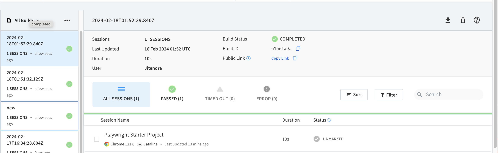

# Playwright Starter

Saucelabs demo site automation using Playwright

## Overview

This project is a TypeScript-based automation framework using Playwright. It supports functional testing, visual testing, accessibility testing.

## Table of Contents

- [Getting Started](#getting-started)
  - [Prerequisites](#prerequisites)
  - [Installation](#installation)
- [Project Structure](#project-structure)
- [Configuration](#configuration)
- [Cloud Execution Platforms](#cloud)
  - Browserstack Integration
- [Automation Support For](#usage)
  - [Functional E2E Testing](#functional-testing)
  - [Visual Automation](#visual-automation)
  - [Accessibility Testing](#accessibility-testing)
- [Reporting Supports](#reporting)
  - [Playwright html report](#html)
  - [Reportportal Integration](#reportportal-integration)
- [Contributing](#contributing)
- [License](#license)

## Getting Started

### Prerequisites

Ensure you have the following prerequisites installed:

- Node.js
- npm (Node Package Manager)

### Installation

Install project dependencies using the following command:

`npm install`

## Project Structure
Details coming soon...

## Configuration
Details coming soon...

## Cloud Execution Platforms

### Browserstack Integration 
- To run this project on browserstack platform, user need to pass  parameter `RUN_ON_BROWSERSTACK` through command line. 
Example : RUN_ON_BROWSERSTACK=true npx playwright test << spec file name >>

Browserstack execution Dashboard : 

## Supported Testing Types: 
### Functional Testing 
Details coming soon...

### Visual Testing
Details coming soon...

### Accessibility Testing
Details coming soon...

## Reporting Supports:

### Playwright HTML Report
Details coming soon...

### Reportportal Integration
Details coming soon...

## Contributing
Details coming soon...

## License
Details coming soon...