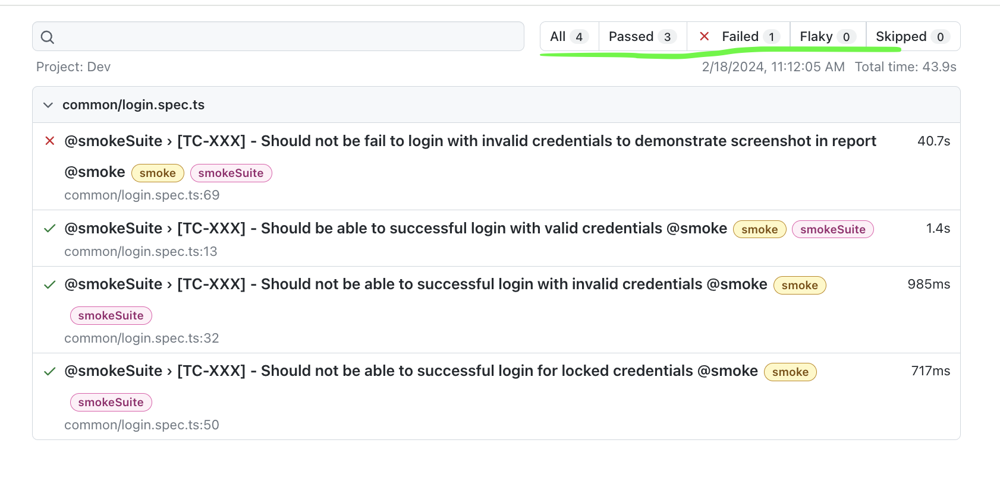
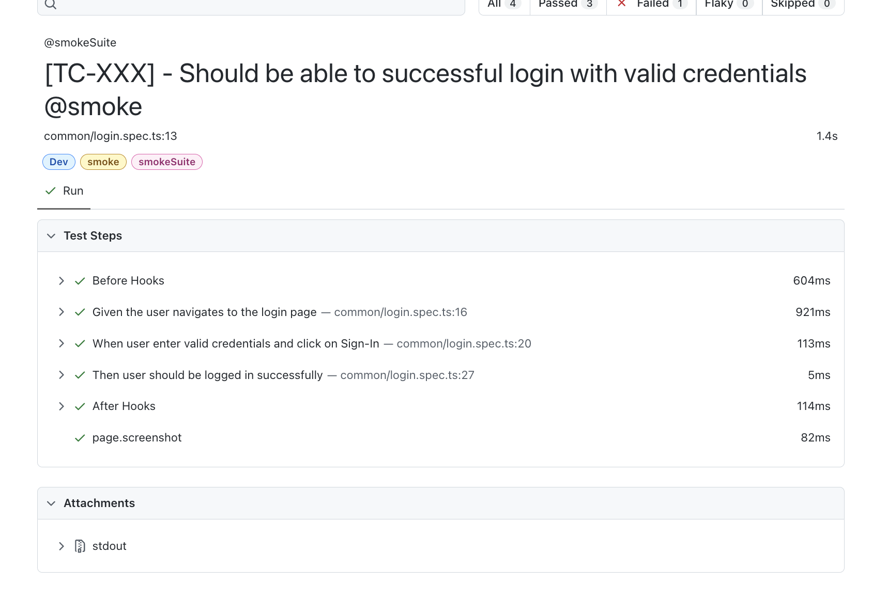
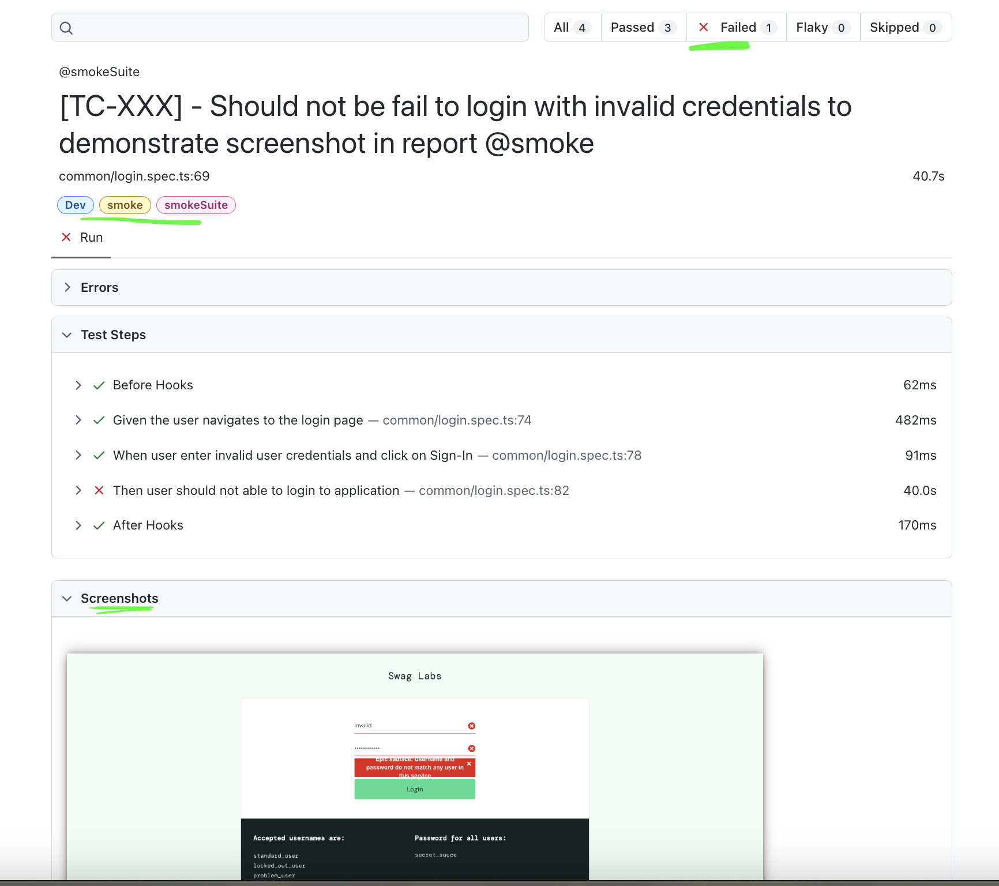
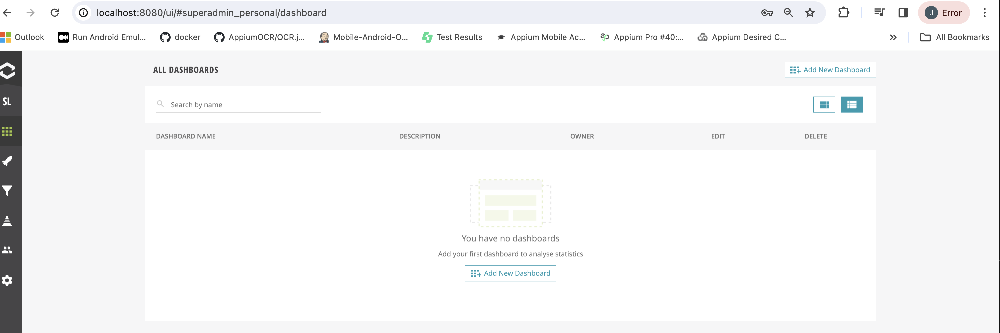
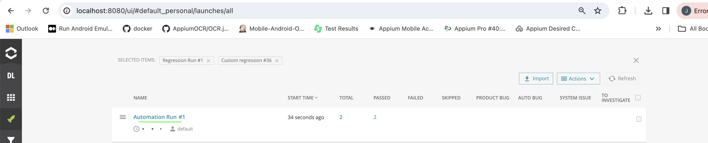
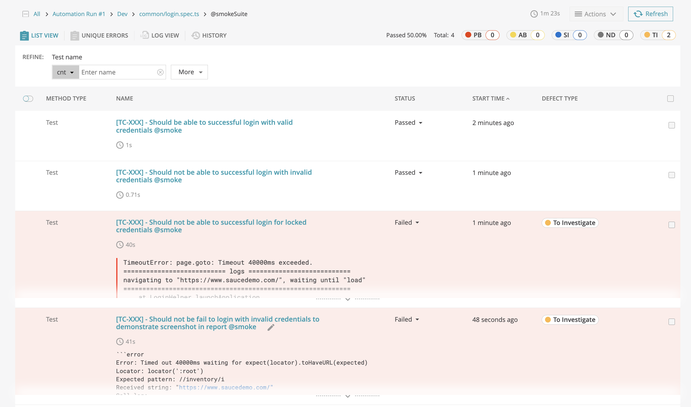
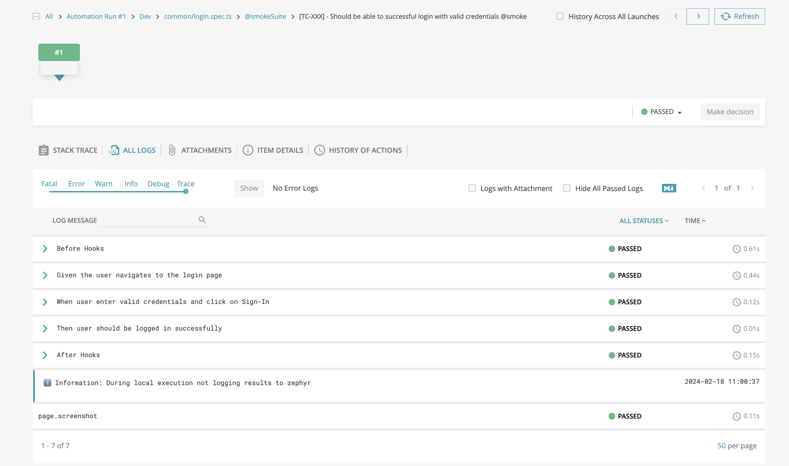

# Playwright Starter

Saucelabs demo site automation using Playwright

## Overview

This project is a TypeScript-based automation framework using Playwright. It supports functional testing, visual testing, accessibility testing.

## Table of Contents

- [Getting Started](#getting-started)
  - [Prerequisites](#prerequisites)
  - [Installation](#installation)
- [Project Structure](#project-structure)
- [Configuration](#configuration)
- [Cloud Execution Platforms](#cloud)
  - Browserstack Integration
- [Automation Testing Support](#automation-testing-support)
  - [Functional E2E Testing](#functional-testing)
  - [Visual Automation](#visual-automation)
  - [Accessibility Testing](#accessibility-testing)
- [Reporting Supports](#reporting)
  - [Playwright HTML Report](#playwright-html-report)
  - [Reportportal](#reportportal)
- [Contributing](#contributing)
- [License](#license)

## Getting Started

### Prerequisites

Ensure you have the following prerequisites installed:

- Node.js
- npm (Node Package Manager)

### Installation

Install project dependencies using the following command:

`npm install`

## Project Structure
Details coming soon...

## Configuration
Details coming soon...

## Cloud Execution Platform Support

### Browserstack Integration 
- To run this project on browserstack platform, user need to pass  parameter `RUN_ON_BROWSERSTACK` through command line. 
Example : RUN_ON_BROWSERSTACK=true npx playwright test << spec file name >>

**Browserstack execution Dashboard :** 

## Automation Testing Support: 
Our project offers comprehensive testing capabilities, providing automation support for various types of testing:

### Functional Testing 
Details coming soon...

### Visual Testing
Details coming soon...

### Accessibility Testing
Details coming soon...

## Supported Report Format:

### Playwright HTML Report
Upon completion of execution run the below command to generate HTML report.
`npx playwright show-report` 

**Report View :** 

**Pass Test View :** 

**Failed Test View :**

### Reportportal
ReportPortal brings a transparent process to every testing stage and related software test reporting.
- Manage all automation reports and results in one place
- Make results analysis actionable & collaborative
- Accelerate routine results analysis with AI

- Please refer below section for Reportportal integration. 

Documention for Reportportal installation using docker - https://reportportal.io/installation

After successful installation,retrive api token key from `Profile -> API Keys` section and use it in  `playwright.config.ts -> rpConfig.apiKey` object.

**Reportportal Dashboard :**

**Launch View :**

**Test Run View :**

**Test View :**

## Contributing
Details coming soon...

## License
Details coming soon...